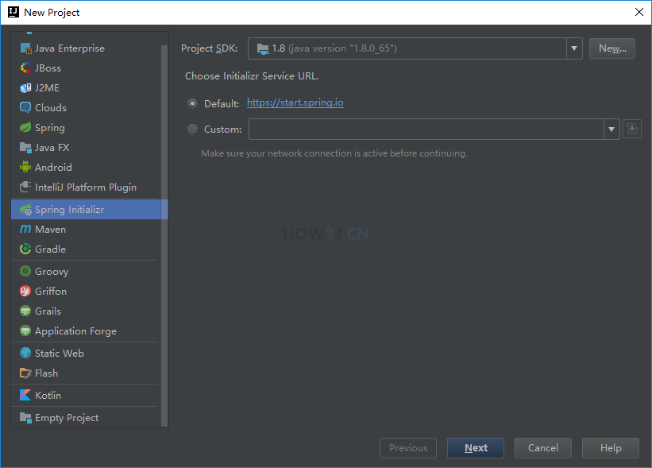
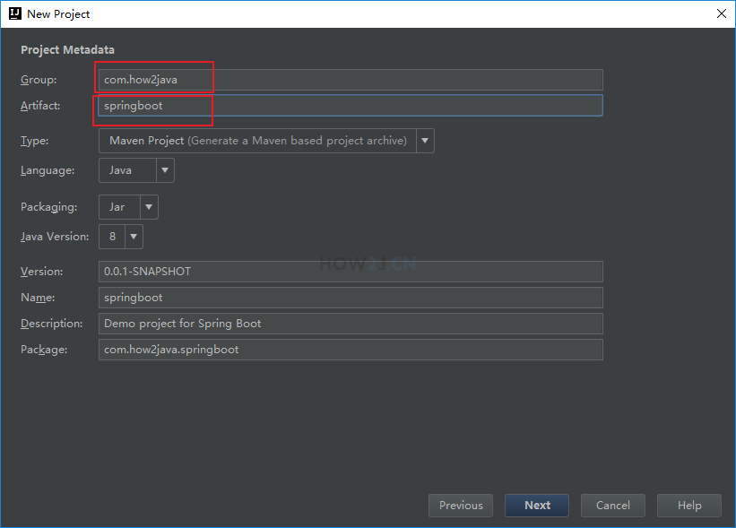
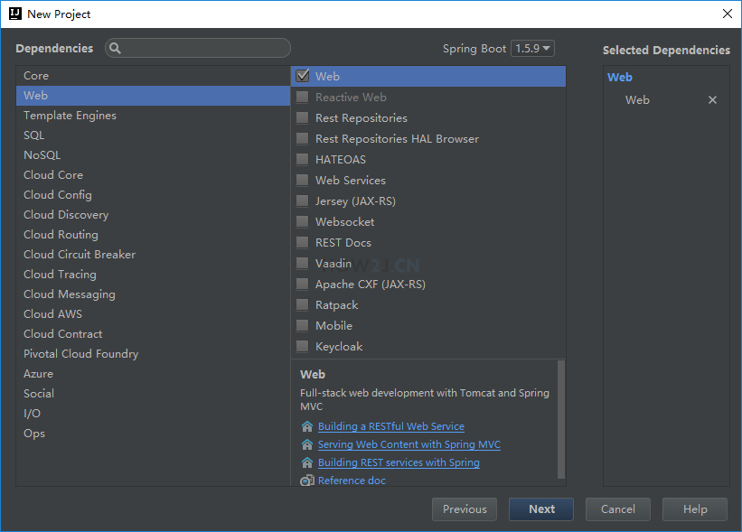
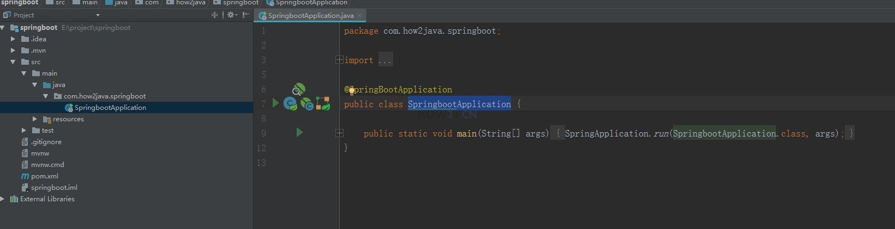

#一、SpringBoot第一个入门案例
1. 创建项目
> 菜单 -> New -> Project -> Spring Initializr 然后点 Next



2.项目参数
> 输入如图所示的两个地方的参数，其他参数不用修改，然后Next



3.选择Web模块
> 接着左边选择 Web, 右边只勾选 Web 即可，然后点击Next



4.SpringbootApplication.java
> 项目创建好之后，就自带一个SpringbootApplication, 其被@SpringBootApplication 所标记，表示这个是一个Springboot 应用



5.HelloController.java
> 新建包 com.how2java.springboot.web， 然后在其下新建类HelloController.
这个类就是Spring MVC里的一个普通的控制器。
@RestController 是spring4里的新注解，是@ResponseBody和@Controller的缩写。

```java
package com.how2java.springboot.web;
import org.springframework.web.bind.annotation.RequestMapping;
import org.springframework.web.bind.annotation.RestController;
 
@RestController
public class HelloController {
 
    @RequestMapping("/hello")
    public String hello() {
        return "Hello Spring Boot!";
    }
 
}
```

6.运行并测试
> 接下来就运行 SpringbootApplication.java， 然后访问地址
> http://127.0.0.1:8080/hello


