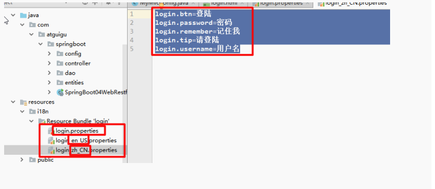
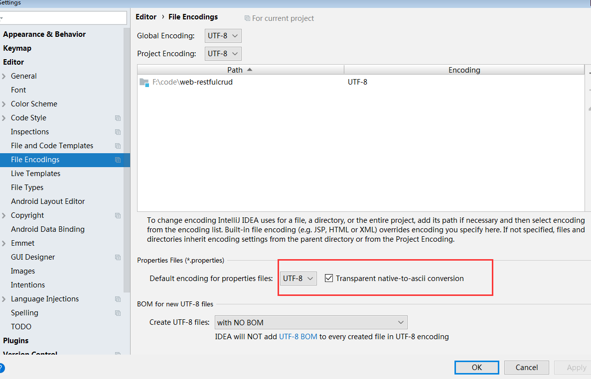
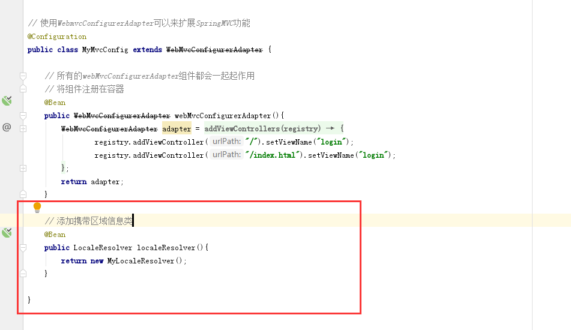

### 一、springboot之国际化

#### 编写国际化的步骤
1. 编写配置文件


2. 设置项目的配置


3. springboot自动配置好了管理国际化资源文件的组件（在配置文件修改）
> spring.messages.basename=i18n.login

4. 去页面获取国际的值

```xml
<!DOCTYPE html>
<html lang="en"  xmlns:th="http://www.thymeleaf.org">
<head>
    <meta http-equiv="Content-Type" content="text/html; charset=UTF-8">
    <meta name="viewport" content="width=device-width, initial-scale=1, shrink-to-fit=no">
    <meta name="description" content="">
    <meta name="author" content="">
    <title>Signin Template for Bootstrap</title>
    <!-- Bootstrap core CSS -->
    <link href="asserts/css/bootstrap.min.css" th:href="@{/webjars/bootstrap/4.0.0/css/bootstrap.css}" rel="stylesheet">
    <!-- Custom styles for this template -->
    <link href="asserts/css/signin.css" th:href="@{/asserts/css/signin.css}" rel="stylesheet">
</head>
<body class="text-center">
<form class="form-signin" action="dashboard.html" th:action="@{/user/login}" method="post">
    
    <h1 class="h3 mb-3 font-weight-normal" th:text="#{login.tip}">Please sign in</h1>
    <!--判断-->
    <p style="color: red" ></p>
    <label class="sr-only" th:text="#{login.username}">Username</label>
    <input type="text"  name="username" class="form-control" placeholder="Username"  required="" autofocus="">
    <label class="sr-only"  th:text="#{login.password}">Password</label>
    <input type="password" name="password" class="form-control" placeholder="Password"  required="">
    <div class="checkbox mb-3">
        <label>
            <input type="checkbox" /> [[#{login.remember}]]
        </label>
    </div>
    <button class="btn btn-lg btn-primary btn-block" type="submit" th:text="#{login.btn}">Sign in</button>
    <p class="mt-5 mb-3 text-muted">© 2017-2018</p>
    <a class="btn btn-sm" th:href="@{/index.html(l='zh_CN')}">中文</a>
    <a class="btn btn-sm" th:href="@{/index.html(l='en_US')}">English</a>
</form>
</body>

</html>


```

> 效果：根据浏览器语言设置的信息切换了国际化；

原来:
> 国际化Locale（区域信息对象）；LocaleResolver（获取区域信息对象）；

```
@Bean 
@ConditionalOnMissingBean 
@ConditionalOnProperty(prefix = "spring.mvc", name = "locale")
public LocaleResolver localeResolver() { 
         if (this.mvcProperties .getLocaleResolver() == WebMvcProperties.LocaleResolver.FIXED) { 
               return new FixedLocaleResolver(this.mvcProperties.getLocale()); 
             }
        AcceptHeaderLocaleResolver localeResolver = new AcceptHeaderLocaleResolver()localeResolver.setDefaultLocale(this.mvcProperties.getLocale()); 
           return localeResolver; 
      } 
// 默认的就是根据请求头带来的区域信息获取Locale进行国际化

```


#### 点击链接切换国际化

```java
        public class MyLocaleResolver implements LocaleResolver {
    @Override
    public Locale resolveLocale(HttpServletRequest request) {
        String l = request.getParameter("l");
        Locale locale = Locale.getDefault();
        if (!StringUtils.isEmpty(l)){
            String[] split = l.split("_");
            locale = new Locale(split[0],split[1]);
        }
        return locale;
    }

    @Override
    public void setLocale(HttpServletRequest httpServletRequest, HttpServletResponse httpServletResponse, Locale locale) {

    }
}       


```


