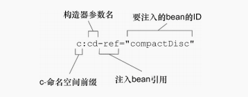
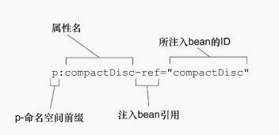

### Spring装配的可选方案
Spring具有非常大的灵活性,提供三种主要的配置机制:

- 在XML中进行显示配置
- 在java中进行显示配置
- 隐式的bean发现机制和自动装配


> 注：尽可能地使用自动配置的机制。显示配置越少越好。当你必须要显示配置bean的时候,推荐使用类型安全并且比XML更加强大的JavaConfig。

### 自动化装配bean

Spring从两个角度来自动化装配:
- 组件扫描:Spring会自动发现应用上下文中所创建的bean
- 自动装配:Spring自动满足bean之间的依赖

1. 创建可被发现的bean
例子:CD与CD播放器
程序清单1.1 CompactDisc接口在Java中定义了CD

```java
  public interface CompactDisc {
    void play();
  }

```

程序清单1.2 带有@Component注解的CompactDisc实现类SetPeppers

```java


@Component
public class SgtPeppers implements CompactDisc{
    private String title = "Sgt. Pepper's Lonely Hearts Club Band";
    private String artist = "The Beatles";
    public void play() {
            System.out.println("Playing" +title+"by" +artist);
    }
}


```

> @Componet注解，表面该类会做为组件类,并告知Spring要为这个类创建bean。组件扫描默认是不启用的。我们还需要显示配置一下Spring,从而命令它去寻找带有@Componet注解的类,并起创建bean。

程序清单1.3 @ComponentScan注解启用了组件扫描
```java
@Configuration
@ComponentScan
public class CDplayerConfig {

    @Bean
    public CompactDisc sgtPeppers(){
        return new SgtPeppers();
    }
}

// 如果没有其它配置的话,@ComponentScan默认会扫描与配置相同的包

```

程序清单1.4 通过XML启用组件扫描
```xml
  <context:component-scan base-package="">

```

2. 为组件扫描的bean命名
Spring应用上下中所有的bean都会给定一个ID。如果我们没有设置,但Spring会根据类名为其指定一个ID,将类名的第一个字母变为小写。

如果要为这个bean设置不同的ID,可以将ID作为值传递给@Component注解

> @Component("")

另外一种为Bean命名方式,不使用@Component注解,而是使用java依赖注入规范中所提供的@Named注解来为bean设置ID
```java
@Named("")
public class SgtPeppers implements CompactDics{

}
```

3. 设置组件扫描的基础包

```java

/** 第一种默认扫描当前的类包
    @ComponentScan("") 
   
    第二种扫描不同的基础配置包
    @ComponentScan(basePackages={"",""})


*//


```

4. 通过为bean添加注解实现自动装配
自动装配就是让Spring自动满足bean依赖的一种方法,在满足依赖的过程中会在Spring应用上下文中寻找匹配某个bean需求的其它bean。为了声明要进行自动装配,可以借助Spring的@Autowired注解

程序清单4.1 通过自动配置,将一个CompactDisc注入到CDPlayer之中
```java

public class CDPlayer implements  MediaPlay{

     private CompactDisc cd ;
     @Autowired
     public CDPlayer(CompactDisc cd ){
         this.cd = cd ;
     }
    public void play() {
         cd.play();
    }
}


```

> @Autowired不仅可以在构造函数,还可以用在类的任何方法上

注意：
```java

@Autowired(required=false)
public CDPlayer(CompactDisc cd){
  this.cd = cd ;
} 

// 如果没有匹配的bean,那么在应用上下文创建的时候,Spring会抛出一个异常。为了避免异常的出现，可以将@Autowired的required属性设置为false、

// 将request属性设置为false时,Spring会尝试执行自动装配,但是如果没有匹配的bean的话,Spring将会让这个bean处于未装配的状态.
如果代码没有进行null检查的话,这个处于未装配状态的属性有可能会出现NullPointerException
```

> @Inject注解来源于java依赖注入规范,该规范同时还为我们定义了@Named注解。在自动装配中，Spring同时支持@Inject和@Autowired。尽管@Inject和@Autowird之间有一个细微的差别,但是在大多数场合下,他们是可以相互替换的.

### 通过java代码装配bean
1. 创建配置类

```java
@Configuration
@ComponentScan
public class CDplayerConfig {

    @Bean
    public CompactDisc sgtPeppers(){
        return new SgtPeppers();
    }
}

// @Configuration表面这个类是一个配置类

```

2. 声明简单的bean
要在JavaConfig中声明bean,我们需要编写一个方法,这个方法会创建所需要类型的实例,然后给这个方法添加@Bean注解

```
@Bean
public CompactDisc sgtPeppers(){
     return new SgtPeppers();

}

```
3. 借助JavaConfig实现注入
在JavaConfig中装配bean最简单方式就是引用创建bean的方法,例如,在下面就是一种声明CDPlayer的可行方案:

```
@Bean
public CDPlayer cdPlayer(){

      return new CDPlayer(sgtPeppers());

}
```

### 通过XML装配bean
1. 声明一个简单的bean
```xml
 <bean id=""  class="">
```

2. 借助构造器注入
在XML中声明DI时,会有很多种可选的配置方案和风格。具体到构造器注入,有两种基本的配置方案可供选择:
- <constructor-arg>元素
- 使用Spring3.0所引入的c-命名空间

例子: 将声明了SgtPeppers bean，并实现了CompactDisc接口注入到CDPlayer。
```xml

<bean id="cdPlayer" class="soundsystem.CDPlayer">
     <constructor-arg ref="compactDisc" />
</bean>

// 当Spring遇到这个<bean>元素时,它会创建一个CDPlayer实例。<constructor-arg>
元素会告知Spring要将一个ID为compactDisc的bean引用传递到CDPlayer的构造器
```

在c-命名空间和模式声明之后,

```xml

<bean id="cdPlayer" class="soundsystem.CDPlayer"
c:cd-ref="compactDics" />

```


装配集合
可以用List和set注入
```xml
<bean id="compactDisc" class="soundsystem.BlankDisc">
   <constructor-arg value="" />
   <constructor-arg value="" />
   <constructor-arg>
       <lsit>
             <value></value>   
             <value></value>
       </list>
   </constructor-arg>


```

可以使用<ref>元素代替<value>,实现bean引用列表的装配。假设一个Disography类,它的构造器
> public Discography(String artist,List<CompactDisc> cds){...}

```xml
<bean id="" class="">
<constructor-arg value=""/>
<constructor-arg>
    <list>
        <ref bean=""/>
        <ref bean=""/> 
        <ref bean=""/>
        <ref bean=""/>
    </list>
<constructor-arg>
</bean>
```

set和list元素的区别不大,最重要的不同在当Spring创建装配的集合时,所创建的是java.util.Set还是java.util.List


3. 设置属性

```
<bean id="cdPlayer" class="soundsystem.CDPlayer">
       <property name="" ref=""/>
</bean>

```
<property>元素为属性的Setter方法所提供的功能与<constructor-arg>元素为构造器所提供的功能一样。

Spring为<constructor-arg>元素提供了c-命名空间作为代替品方案,与之类似,Spring提供了更加简洁的p-命名空间,作为<property>元素的代替方案，为了启用p-命名空间,必须要在XML文件中与其他命名空间一起对其进行声明。
```xml
<beans>
xmlns:p=".../p"


</beans>
```

例子
```xml

<bean id ="" class=""

   p:compactDisc-ref=""
/>
```

p-命名空间属性组成

