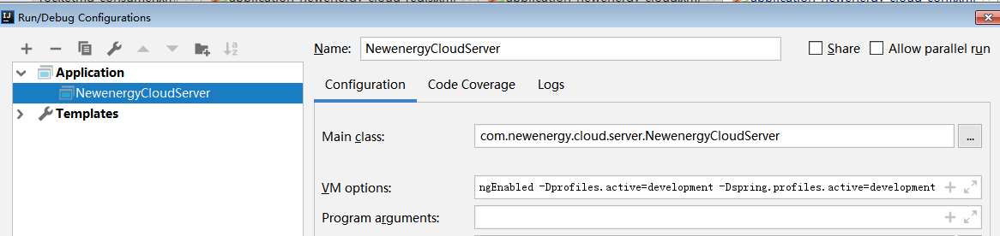

### 环境与profile
常用简单例子
```xml
<?xml version="1.0" encoding="UTF-8"?>
<beans xmlns="http://www.springframework.org/schema/beans"
	xmlns:xsi="http://www.w3.org/2001/XMLSchema-instance" xmlns:context="http://www.springframework.org/schema/context"
	xmlns:util="http://www.springframework.org/schema/util" xmlns:aop="http://www.springframework.org/schema/aop"
	xmlns:tx="http://www.springframework.org/schema/tx" xmlns:beans="http://www.springframework.org/schema/beans"
	xsi:schemaLocation="http://www.springframework.org/schema/aop http://www.springframework.org/schema/aop/spring-aop-3.1.xsd
		http://www.springframework.org/schema/beans http://www.springframework.org/schema/beans/spring-beans-3.1.xsd
		http://www.springframework.org/schema/util http://www.springframework.org/schema/util/spring-util-3.1.xsd
		http://www.springframework.org/schema/tx http://www.springframework.org/schema/tx/spring-tx-3.1.xsd
		http://www.springframework.org/schema/context http://www.springframework.org/schema/context/spring-context-3.1.xsd">
	
	<!-- 开发环境 -->
	<beans:beans profile="development">
		<util:properties id="httpConfig" location="classpath:properties/http.properties"/>
		<util:properties id="consumerConfig" location="classpath:properties/rocketmq-consumer.properties"/>
		<util:properties id="redisConfig" location="classpath:properties/redis.properties"/>
		<util:properties id="jdbcConfig" location="classpath:properties/jdbc.properties"/>
		<util:properties id="jdbcSecondConfig" location="classpath:properties/jdbcSecond.properties" />

	</beans:beans>
	
	<!-- 生产环境 -->
    <beans:beans profile="test,production">
		<util:properties id="httpConfig" location="file:${java.project.conf.path}/newenergy-cloud/properties/http.properties"/>
		<util:properties id="consumerConfig" location="file:${java.project.conf.path}/newenergy-cloud/properties/rocketmq-consumer.properties"/>
		<util:properties id="redisConfig" location="file:${java.project.conf.path}/newenergy-cloud/properties/redis.properties"/>
		<util:properties id="jdbcConfig" location="file:${java.project.conf.path}/newenergy-cloud/properties/jdbc.properties"/>
		<util:properties id="jdbcSecondConfig" location="file:${java.project.conf.path}/newenergy-cloud/properties/jdbcSecond.properties"/>
    </beans:beans>
   
</beans>


```

> -server -Xms512M -Xmx512M -XX:PermSize=512m -XX:MaxPermSize=512M -XX:+CMSClassUnloadingEnabled -Dprofiles.active=development -Dspring.profiles.active=developmen

### 条件化bean
> Spring4引入了一个新的@Conditional注解,它可以用到带有@bean注解方法上,如果给定的条件计算结果为true就创建这个bean,否则的话就会无视。

### 处理自动装配的歧义性
> 在声明bean的时候,通过将可选的bean设置为首选(primary)bean能够自动避免装配上歧义
> 如果是使用XML配置bean,<bean>元素有一个primary属性来指定首选bean。
但是如果标出了2个或者更多首选bean，那么spring就无法正常工作了。

1. 限定自动装配的bean
@Qualifier注解是使用限定符的主要方式。他可以与@Au
### bean的作用域

2. bean的作用域
> 在默认情况下,Spring应用上下文所有bean都是作为单例的形式创建,也就是说,不管给定一个bean被注入其它bean多少次,每次所注入是都是同一个实例。
- 单例:在整个应用中,只创建bean的一个实例。
- 原型:每次注入或者通过Spring应用上下文获取的时候,都会创建一个新Bean实例。
- 会话:在Web应用中,为每个会话创建一个bean实例。
- 请求:在Web应用中,为每一个请求创建一个bean实例。

例如,如果你使用组件扫描来发现和声明bean,那么你可以在bean的类上使用@Scope注解,将其声明为原型bean
@Componet
@Scope(ConfigurableBeanFactory.SCOPE_PROTOTYPE)
public class Notepad{...}
这里使用ConfigurableBeanFactory类的SCOPE PROTOTYPE常量设置了原型作用域。当然也可以使用@Scope("prototype"),但是使用SCOPE_PROTOTYPE常量更加安全并不易出错。

