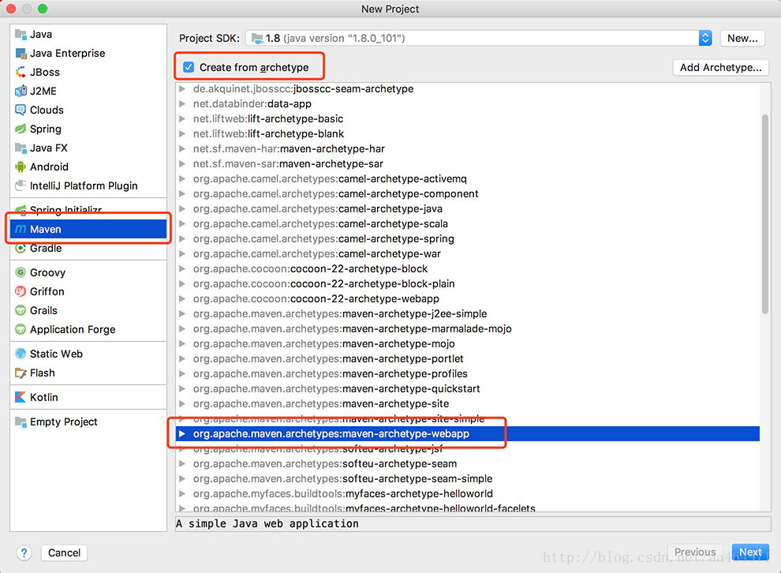
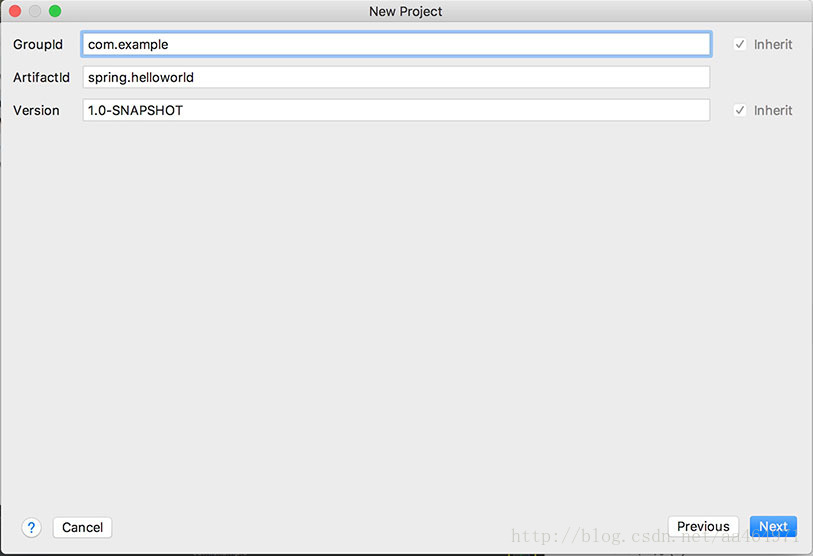
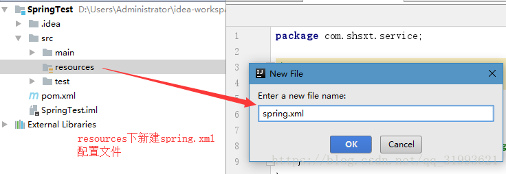
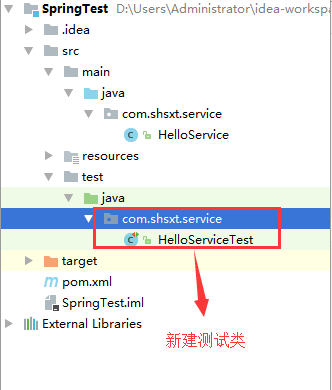
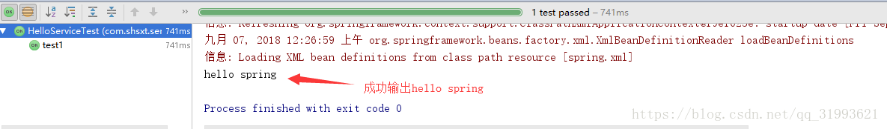

## 一、创建新项目

- 创建一个新项目，Maven - Create from archetype，选中maven-archetype-webapp这个archetype



- 输入GroupId和ArtifactId



- 输入项目名称并选择项目存放的路径


## 二、引入Spring
- 打开pom.xml，引入Spring

```
<!-- spring框架核心-->
<dependencies>
    <dependency>
        <groupId>org.springframework</groupId>
        <artifactId>spring-context</artifactId>
        <version>4.3.9.RELEASE</version>
    </dependency>

    <dependency>
        <groupId>junit</groupId>
        <artifactId>junit</artifactId>
        <version>4.12</version>
        <scope>test</scope>
    </dependency>
    <!--spring test-->
    <dependency>
        <groupId>org.springframework</groupId>
        <artifactId>spring-test</artifactId>
        <version>4.2.4.RELEASE</version>
    </dependency>
    <dependency>
        <groupId>junit</groupId>
        <artifactId>junit</artifactId>
        <version>4.12</version>
        <scope>compile</scope>
    </dependency>
</dependencies>

```

- 编写 bean


```
package com.shsxt.service;

public class HelloService {
    public void hello(){
        System.out.println("hello spring");
    }
}

```
 
- spring 配置文件的编写
在 src 下新建 xml 文件，并拷贝官网文档提供的模板内容到 xml 中，配置bean 到 xml 中,把对应 bean 纳入到 spring 容器来管理


```xml
    
<?xml version="1.0" encoding="UTF-8"?>
<beans xmlns="http://www.springframework.org/schema/beans"
xmlns:xsi="http://www.w3.org/2001/XMLSchema-instance"
xsi:schemaLocation="http://www.springframework.org/schema/beans
http://www.springframework.org/schema/beans/spring-beans.xsd">
<!--
xmlns 即 xml namespace xml 使用的命名空间
xmlns:xsi 即 xml schema instance xml 遵守的具体规范
xsi:schemaLocation 本文档 xml 遵守的规范 官方指定
-->
<bean id="helloService" class="com.shsxt.service.HelloService"></bean>
</beans>
```


- 验证 spring 框架环境是否搭建成功


```
package com.shsxt.service;

import org.junit.Test;
import org.springframework.context.ApplicationContext;
import org.springframework.context.support.ClassPathXmlApplicationContext;


public class HelloServiceTest {
    @Test
    public void test1() throws Exception {
        /**
         * 1.加载Spring的配置文件
         * 2.取出Bean容器中的实例
         * 3.调用bean方法
         */
        // 1.加载Spring的配置文件
        ApplicationContext context = new ClassPathXmlApplicationContext("spring.xml");
        // 2.取出Bean容器中的实例
        HelloService helloService = (HelloService) context.getBean("helloService");
        // 3.调用bean方法
        helloService.hello();
    }

}

```

- 验证结果


